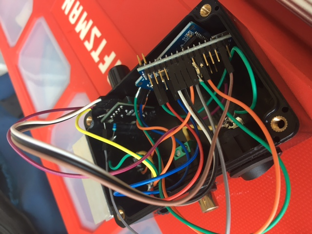

### PEMF Generator

A PEMF Generator is just a signal generator, an amplifier, and a coil to emit a magnet field. I've built a few models at this point because they help quite a bit with back pain, and inflation in general.  
I built a small version for a friend of mine:
https://vimeo.com/590700327

And the internals:

For more info on PEMF check this link:
https://www.gildeachiropractic.com/blog/posts/pulsed-electromagnetic-field-therapy
